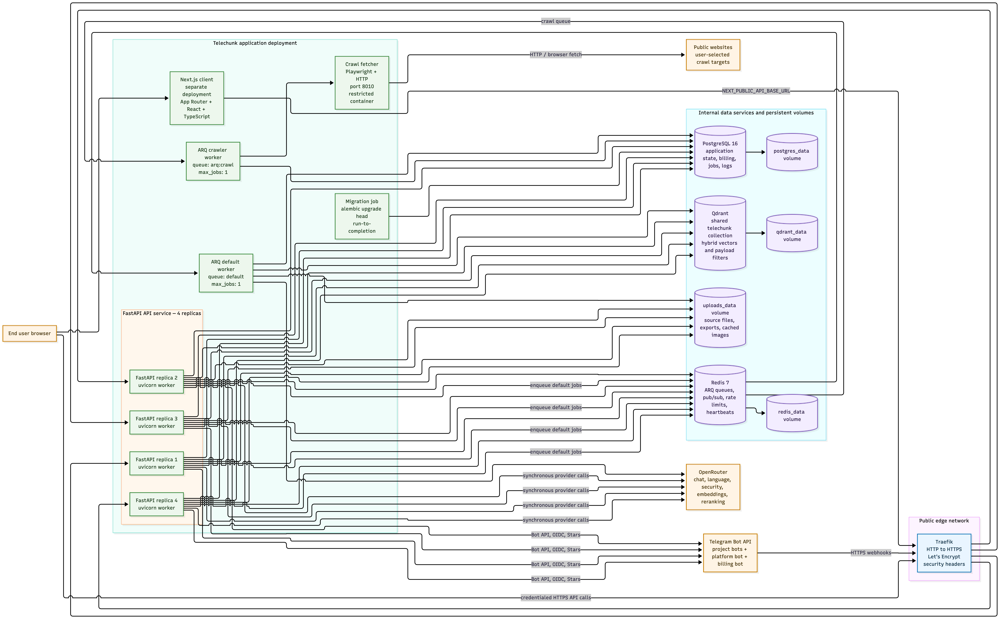
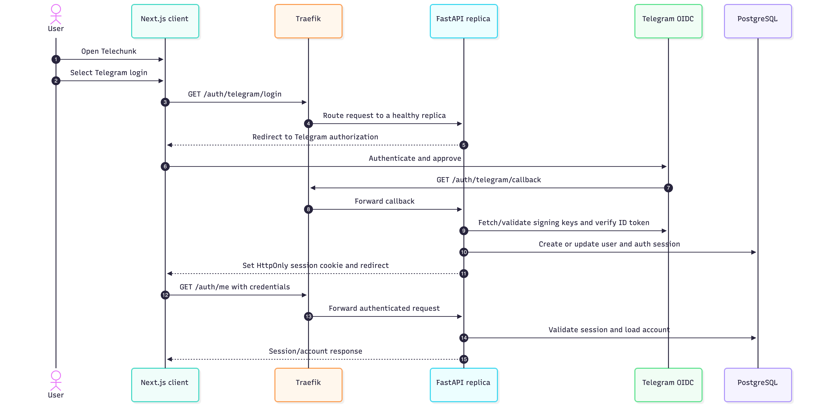
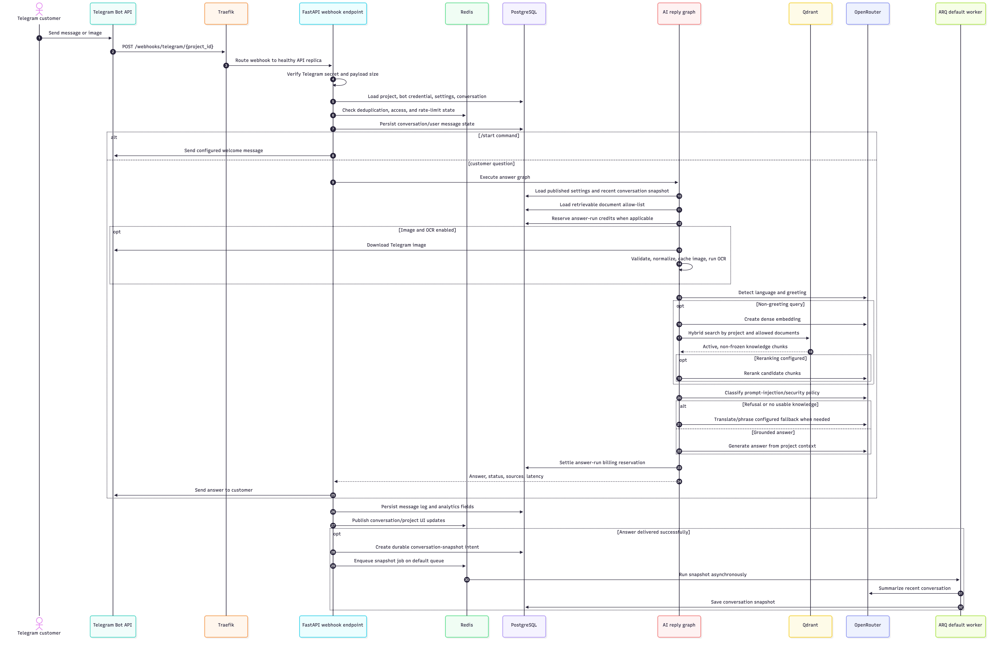
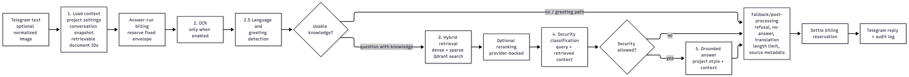
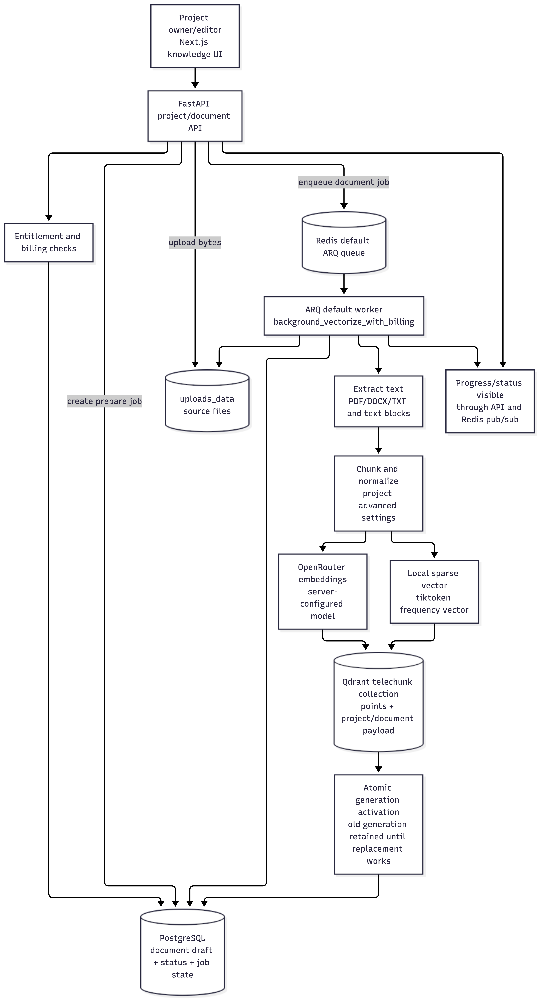
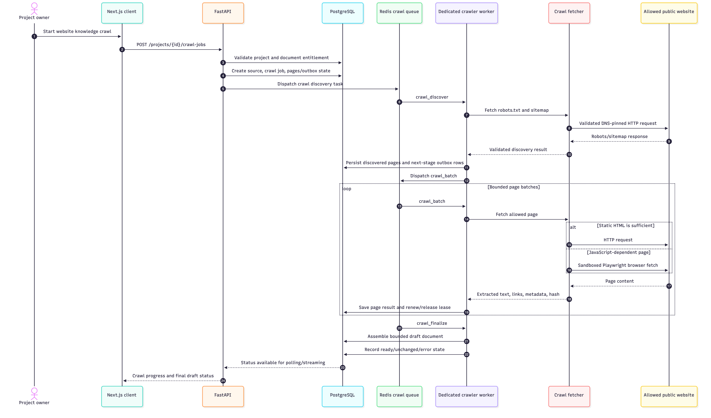
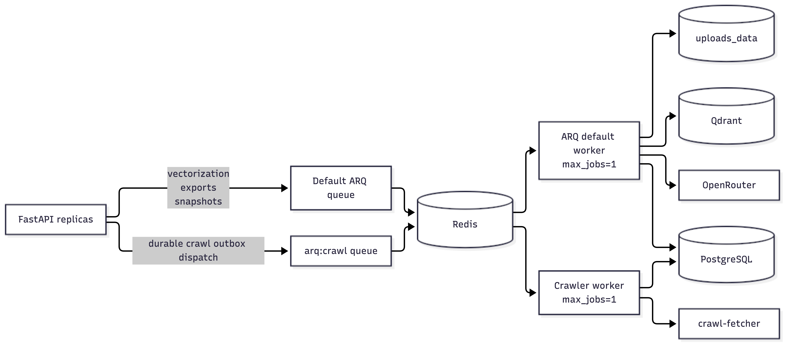
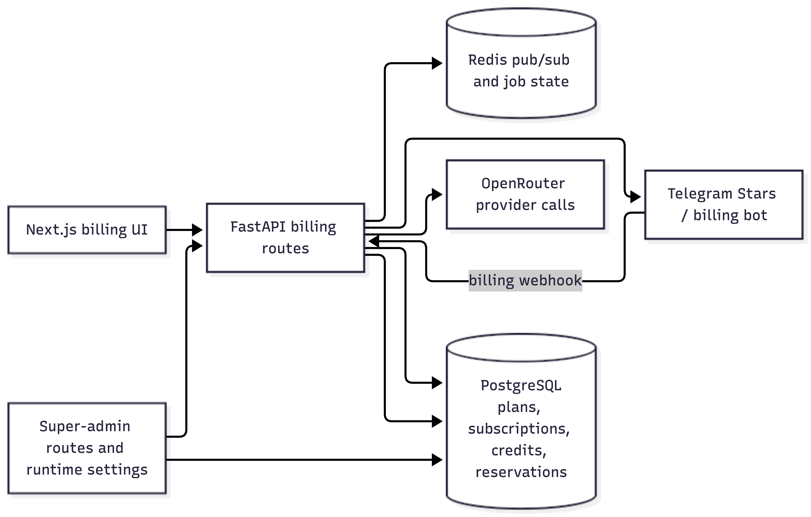

# Telechunk Public Architecture & Engineering Specification

Telechunk is an enterprise-grade, multi-tenant AI customer service assistant platform for Telegram. Powered by Retrieval-Augmented Generation (RAG), Telechunk pairs custom Telegram bots with private knowledge bases, automated website crawling, multimodal document indexing, hybrid vector retrieval, and resilient background job execution.

This repository documents the production architecture, component interactions, authentication flows, data ingestion pipelines, background queues, and billing systems of Telechunk.

---

## Product Demonstration

[](https://youtu.be/-ujknCME0hI)

## Table of Contents

1. [Production Deployment Topology](#1-production-deployment-topology)
2. [Browser Authentication & API Flow](#2-browser-authentication--api-flow)
3. [Telegram Customer Message Lifecycle](#3-telegram-customer-message-lifecycle)
4. [AI Reply Graph Pipeline Stages](#4-ai-reply-graph-pipeline-stages)
5. [Knowledge Ingestion & Indexing Pipeline](#5-knowledge-ingestion--indexing-pipeline)
6. [Website Crawling Engine](#6-website-crawling-engine)
7. [Background Job Topology & Task Processing](#7-background-job-topology--task-processing)
8. [Billing & Control-Plane Integrations](#8-billing--control-plane-integrations)
9. [Technology Stack Reference](#9-technology-stack-reference)

---

## 1. Production Deployment Topology

The Telechunk architecture is structured around containerized microservices managed behind a security-hardened public edge network.



### Key Architecture Components

- **Public Edge Network (Traefik)**: Acts as the primary ingress controller. Handles TLS termination via Let's Encrypt, HTTP to HTTPS enforcement, security header injection, and routes public webhooks and client traffic.
- **Next.js Client**: A standalone web dashboard built with Next.js App Router, React, and TypeScript. Communicates with backend endpoints via `NEXT_PUBLIC_API_BASE_URL`.
- **FastAPI API Service**: Scaled across 4 horizontal replicas running `uvicorn` workers. Handles user sessions, tenant administration, document uploads, project management, and inbound Telegram webhooks.
- **Asynchronous Background Workers (ARQ)**:
  - **Default Worker** (`queue: default`, `max_jobs: 1`): Executes heavy compute background tasks including file extraction, vector embedding, snapshot summarizations, and export generation.
  - **Crawler Worker** (`queue: arq:crawl`, `max_jobs: 1`): Processes web crawl discovery jobs and page fetching batches.
- **Crawl Fetcher Service**: A dedicated, security-restricted microservice operating on port `8010` running Playwright and HTTP fetch drivers for scraping external target sites.
- **Database & Persistence Tier**:
  - **PostgreSQL 16** (`postgres_data` volume): Stores persistent relational state, user profiles, tenant configurations, subscriptions, job execution outboxes, and audit logs.
  - **Qdrant Vector DB** (`qdrant_data` volume): Multi-tenant vector database maintaining dense and sparse vectors with project/document payload filters.
  - **Redis 7** (`redis_data` volume): High-performance memory broker handling ARQ queues, pub/sub channels, API rate-limiting, and worker heartbeats.
  - **Uploads Storage** (`uploads_data` volume): Dedicated volume for raw customer uploads, export artifacts, and cached OCR image assets.
- **External Integrations**:
  - **Telegram Bot API**: Receives customer messages via webhooks and dispatches AI responses. Supports project bots, platform administration, and Telegram Stars payment bots.
  - **OpenRouter API**: Cloud provider gateway for chat completions, security policy evaluation, language detection, dense embeddings, and reranking.

---

## 2. Browser Authentication & API Flow

Telechunk utilizes Telegram OpenID Connect (OIDC) for secure, passwordless authentication, backed by `HttpOnly` session cookie validation.



### Authentication Sequence

1. **User Initiation**: The user opens the Telechunk web client and selects "Login with Telegram".
2. **Auth Request**: The Next.js client sends `GET /auth/telegram/login` through Traefik to a healthy FastAPI replica.
3. **Redirect to Telegram**: FastAPI constructs the auth challenge and redirects the browser to the Telegram authorization endpoint.
4. **Approval**: The user authenticates and grants approval within Telegram OIDC.
5. **Callback Processing**: Telegram redirects back to `GET /auth/telegram/callback`.
6. **Token Verification**: FastAPI fetches public signing keys from Telegram, verifies the ID token integrity, and validates claims.
7. **Session Creation**: The user account and session details are persisted or updated in PostgreSQL.
8. **Secure Cookie Delivery**: FastAPI responds with an `HttpOnly` session cookie and redirects the user back to the dashboard.
9. **Authenticated Requests**: Subsequent API calls (e.g., `GET /auth/me`) send credentials through Traefik; FastAPI verifies the session against PostgreSQL before serving requests.

---

## 3. Telegram Customer Message Lifecycle

When a user messages a project's Telegram bot, the system executes an end-to-end processing lifecycle from webhook ingestion to AI reply generation and async context summarization.



### Execution Sequence

1. **Webhook Ingestion**: Telegram delivers customer messages via `POST /webhooks/telegram/{project_id}` through Traefik to a FastAPI replica.
2. **Verification & Rate Limiting**: FastAPI verifies the Telegram secret header, inspects payload size, checks Redis rate limits, and validates project state in PostgreSQL.
3. **Command Handling**:
   - `/start` command: FastAPI immediately dispatches the configured project welcome message back to Telegram.
   - Standard Question: Hands off execution to the **AI Reply Graph**.
4. **Context & Reservation**:
   - The AI graph loads published project settings, active document allow-lists, and the recent conversation snapshot from PostgreSQL.
   - Reserves answer-run credits in PostgreSQL.
5. **Multimodal Processing (Optional)**:
   - If an image is sent and OCR is enabled, the image is downloaded from Telegram, normalized, cached, and processed for optical character recognition.
6. **Retrieval & Reranking**:
   - Language and greeting status are evaluated via OpenRouter.
   - Non-greeting queries generate dense embeddings via OpenRouter and perform a hybrid vector search against Qdrant (filtered by project and allowed documents).
   - If enabled, candidate chunks undergo provider-backed reranking via OpenRouter.
7. **Security & Generation**:
   - Prompt-injection defense policies screen the input and retrieved context.
   - Grounded answer generation occurs via OpenRouter using the project's system prompt and retrieved knowledge.
8. **Settlement & Delivery**:
   - Credit reservations are settled in PostgreSQL.
   - The final reply is dispatched to Telegram Bot API.
   - Message logs and analytics fields are saved to PostgreSQL, while UI updates are broadcasted via Redis pub/sub.
9. **Async Snapshot Generation**:
   - A durable intent is created in PostgreSQL and enqueued onto the Redis ARQ default queue.
   - The ARQ default worker calls OpenRouter asynchronously to summarize the conversation history and updates the snapshot in PostgreSQL.

---

## 4. AI Reply Graph Pipeline Stages

The AI Reply Graph processes incoming questions through modular, deterministic pipeline stages to balance cost, performance, security, and reply quality.



### Graph Execution Workflow

```
[Input: Telegram Text + Optional Image]
                 │
                 ▼
      [1. Context Loading & Credit Reservation]
                 │
                 ▼
          [2. Multimodal OCR (If Enabled)]
                 │
                 ▼
      [2.5 Language & Greeting Detection]
                 │
       ┌─────────┴─────────┐
       ▼                   ▼
 [Greeting / Simple]  [Knowledge Question]
       │                   │
       │                   ▼
       │         [3. Hybrid Retrieval (Qdrant)]
       │                   │
       │                   ▼
       │         [3.5 Reranking (Optional)]
       │                   │
       │                   ▼
       │         [4. Security & Safety Check]
       │                   │
       │          ┌────────┴────────┐
       │          ▼                 ▼
       │      [Refusal]          [Allowed]
       │          │                 │
       │          │                 ▼
       │          │        [5. Grounded Generation]
       │          │                 │
       └──────────┼─────────────────┘
                  ▼
   [6. Fallback & Post-Processing]
                  │
                  ▼
   [7. Settle Billing Reservation]
                  │
                  ▼
  [Output: Telegram Reply + Audit Log]
```

### Stage Breakdown

1. **Context Initialization**: Retrieves project configuration, allowed document boundaries, and active conversation snapshots; holds a fixed billing credit reservation.
2. **OCR Engine**: Normalizes and extracts text from attached image assets if configured for the project.
3. **Greeting Router**: Short-circuits basic greetings or non-informational queries to save vector search latencies and API overhead.
4. **Hybrid Search (Dense + Sparse)**: Executes simultaneous vector lookups (Qdrant) utilizing OpenRouter embeddings and local term frequency vectors.
5. **Reranking**: Scores and filters candidate chunks via LLM rerankers for heightened retrieval precision.
6. **Security Classifier**: Evaluates input against injection vectors and knowledge-boundary policies before generation.
7. **Grounded Generation**: Combines system prompts, context chunks, and conversation history to construct accurate responses.
8. **Post-Processing & Billing**: Handles refusals, fallback phrasing, translation formatting, source metadata tagging, credit settlement, and audit logging.

---

## 5. Knowledge Ingestion & Indexing Pipeline

Telechunk ingests customer documents (PDF, DOCX, TXT), breaks them into optimized chunks, generates dual embeddings, and performs zero-downtime index swaps.



### Ingestion Lifecycle

1. **Upload & Entitlement**:
   - The project owner uploads files via the Next.js Knowledge UI.
   - FastAPI verifies user entitlements and plan limits against PostgreSQL.
   - Raw bytes are saved to the `uploads_data` volume, and document state is set to draft in PostgreSQL.
2. **Task Enqueueing**: FastAPI enqueues a `background_vectorize_with_billing` job onto the Redis ARQ default queue.
3. **Extraction & Chunking**:
   - The ARQ default worker extracts raw text blocks from PDF/DOCX/TXT files.
   - Chunks text according to project advanced chunking settings.
4. **Dual Embedding Generation**:
   - **Dense Vectors**: Generated via server-configured embedding models via OpenRouter.
   - **Sparse Vectors**: Generated locally using a `tiktoken` term-frequency vectorizer.
5. **Vector Indexing & Atomic Swap**:
   - Vectors and payload metadata (project ID, document ID, page numbers) are upserted into Qdrant.
   - **Atomic Generation Activation**: The new index generation is activated atomically; previous index generations remain active until the new swap is confirmed successful.
6. **State & Progress Reporting**: Document draft statuses are updated in PostgreSQL, and real-time processing progress is emitted over Redis pub/sub.

---

## 6. Website Crawling Engine

Telechunk includes a distributed, durable web crawler that discovers, fetches, extracts, and indexes public websites.



### Crawl Protocol & Execution Steps

1. **Crawl Job Initialization**:
   - A user submits a URL target via `POST /projects/{id}/crawl-jobs`.
   - FastAPI verifies entitlement quotas and records initial crawl job, source, and outbox rows in PostgreSQL.
   - FastAPI dispatches a `crawl_discover` task to the `arq:crawl` Redis queue.
2. **Discovery Phase**:
   - The Dedicated Crawler Worker receives `crawl_discover` and requests `robots.txt` and `sitemap.xml` via the Crawl Fetcher.
   - Crawl Fetcher executes DNS-pinned HTTP requests to prevent SSRF vulnerabilities.
   - Discovered links and outbox rows are written to PostgreSQL.
3. **Batch Crawling Loop (`crawl_batch`)**:
   - Worker picks up page batches from the `arq:crawl` queue.
   - Pages are fetched via Crawl Fetcher:
     - **Static HTML**: Fetched via fast, lightweight HTTP requests.
     - **Dynamic JS Pages**: Rendered using a headless, sandboxed Playwright browser container.
   - Extracted text, outgoing links, metadata, and page content hashes are returned to the worker.
   - Results are saved to PostgreSQL with lease renewals to guarantee single-worker processing.
4. **Finalization & Indexing**:
   - Worker dispatches `crawl_finalize`, assembles the collected pages into a draft document, and updates status in PostgreSQL.
   - Real-time progress is streamed back to the Next.js client.

---

## 7. Background Job Topology & Task Processing

Telechunk separates background tasks into distinct Redis queues and dedicated ARQ worker instances to isolate workloads and prevent web crawling from blocking vector ingestion or user snapshots.



### Workload Separation Matrix

| Queue Name | Worker Instance | Max Concurrency | Responsibilities | Target Systems |
| :--- | :--- | :--- | :--- | :--- |
| **Default (`default`)** | ARQ Default Worker | `max_jobs = 1` | Document vectorization (`background_vectorize_with_billing`), file exports, conversation snapshot summarization. | PostgreSQL, Qdrant, OpenRouter, `uploads_data` volume |
| **Crawl (`arq:crawl`)** | ARQ Crawler Worker | `max_jobs = 1` | Discovery (`crawl_discover`), page scraping (`crawl_batch`), draft aggregation (`crawl_finalize`). | PostgreSQL, Crawl Fetcher (Playwright/HTTP) |

---

## 8. Billing & Control-Plane Integrations

Telechunk integrates plan management, token quotas, credit reservations, and Telegram Stars native monetization into a unified control plane.



### Billing & Administrative Features

- **Next.js Billing UI & Super-Admin Console**: Provides tenant usage monitoring, plan upgrades, subscription overrides, and global configuration knobs.
- **Telegram Stars & Billing Bot Integration**: Handles native Telegram payments. Incoming webhooks notify FastAPI billing routes to credit accounts upon successful transactions.
- **Credit Reservations & Settlement**: The AI Reply Graph reserves credits prior to executing LLM/RAG pipelines and settles exact usage upon completion in PostgreSQL.
- **Redis State & Event Broadcasting**: Real-time pub/sub channels notify user dashboards when credit balances change or limits are exceeded.

---

## 9. Technology Stack Reference

| Layer | Component / Tool | Primary Purpose |
| :--- | :--- | :--- |
| **Edge Proxy** | Traefik | TLS termination, Let's Encrypt certificates, reverse proxy, security headers |
| **Frontend UI** | Next.js, React, TypeScript | Web management dashboard, billing management, knowledge portal |
| **Backend API** | FastAPI, Uvicorn, Alembic | Async REST APIs, Telegram webhooks, DB migrations, authentication |
| **Relational DB** | PostgreSQL 16 | Persistent storage for users, sessions, billing, jobs, snapshot state |
| **Vector DB** | Qdrant | Shared collection vector store with payload filters and hybrid search |
| **In-Memory Cache & Broker**| Redis 7, ARQ | Job queue broker, pub/sub messaging, rate limiting, state cache |
| **Crawler Engine** | Playwright, HTTP Fetcher | Headless browser scraping, static HTML extraction, sitemap parser |
| **AI Gateway** | OpenRouter API | Access to LLMs (generation, reranking, OCR, embeddings) |
| **Tokenization** | Tiktoken | Local sparse term frequency vector generation |
